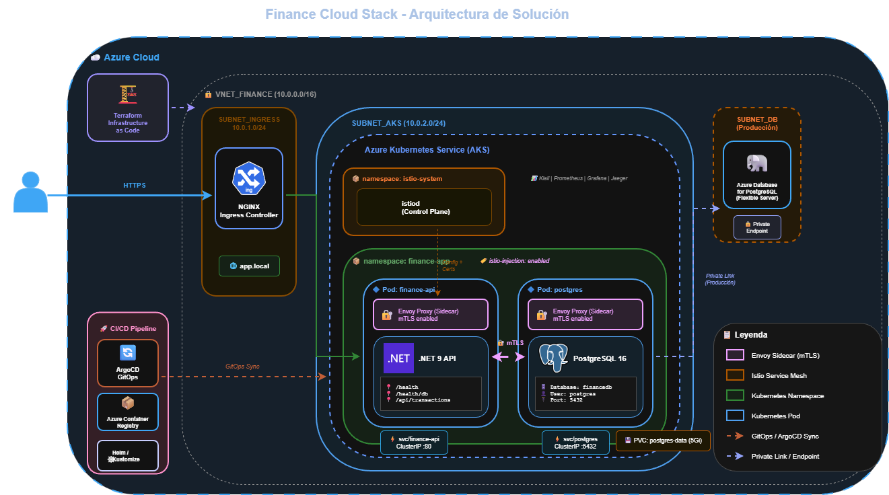

# Visión General de la Arquitectura

## Diagrama de Arquitectura



## Descripción General

Finance Cloud Stack es una arquitectura cloud-native diseñada para aplicaciones financieras de tres capas, implementando las mejores prácticas de seguridad, observabilidad y resiliencia con **Istio Service Mesh**.

### Componentes Principales

| Componente | Tecnología | Propósito |
|------------|------------|-----------|
| **Ingress** | NGINX Controller | Punto de entrada HTTP/HTTPS (app.local) |
| **Service Mesh** | Istio 1.28 | mTLS automático, observabilidad, control de tráfico |
| **Backend** | .NET 9 API | Lógica de negocio y endpoints REST |
| **Base de Datos** | PostgreSQL 16 | Persistencia de transacciones financieras |
| **GitOps** | ArgoCD | Despliegue continuo declarativo |
| **IaC** | Terraform | Infraestructura en Azure |

---

## Justificación Técnica

### ¿Por qué PostgreSQL?

Se eligió **PostgreSQL 16** como motor de base de datos por las siguientes razones:

| Criterio | PostgreSQL | SQL Server | MySQL |
|----------|-----------|------------|-------|
| **Licenciamiento** | Código Abierto (MIT) | Licencia comercial costosa | GPL/Comercial |
| **Soporte Kubernetes** | Excelente | Limitado | Bueno |
| **Rendimiento ACID** | Excelente | Excelente | Bueno |
| **Soporte JSON** | Nativo (JSONB) | Básico | Básico |
| **Costo en la Nube** | Bajo | Alto | Medio |

**Razones específicas para una organización financiera:**

1. **Cumplimiento ACID completo**: Crítico para transacciones financieras
2. **Sin costos de licencia**: Reducción significativa en TCO (Costo Total de Propiedad)
3. **Helm Chart oficial de Bitnami**: Despliegue probado y mantenido
4. **Soporte nativo en Azure**: Azure Database for PostgreSQL como opción administrada
5. **Replicación robusta**: Streaming replication para Alta Disponibilidad

### ¿Por qué Istio Service Mesh?

| Razón | Descripción |
|-------|-------------|
| **mTLS automático** | Cifrado de todo el tráfico interno sin cambios de código |
| **Observabilidad** | Métricas, trazas y logs sin instrumentación manual |
| **Resiliencia** | Circuit breakers, retries y timeouts configurables |
| **Seguridad** | Authorization Policies para modelo Zero Trust |
| **Madurez** | Proyecto CNCF graduado, ampliamente usado en producción |

### ¿Por qué NO Alpine para .NET en este proyecto?

Aunque Alpine reduce el tamaño de imagen, se descartó por:

| Problema | Descripción |
|----------|-------------|
| **Entity Framework** | Incompatibilidades con musl libc de Alpine |
| **PublishTrimmed** | Rompe reflexión de EF Core y System.Text.Json |
| **Estabilidad** | Prioridad sobre tamaño mínimo en entorno financiero |

**Imagen final:** ~220-250 MB con imagen estándar de Debian (mcr.microsoft.com/dotnet/aspnet:9.0)

### Estrategia de Optimización de Imagen Docker

Se implementó un **multi-stage build**:

```dockerfile
# Etapa 1: Compilación (SDK completo)
FROM mcr.microsoft.com/dotnet/sdk:9.0 AS build
WORKDIR /src
COPY . .
RUN dotnet publish -c Release -o /app/publish

# Etapa 2: Ejecución (solo runtime)
FROM mcr.microsoft.com/dotnet/aspnet:9.0
WORKDIR /app
COPY --from=build /app/publish .
USER 1000
ENTRYPOINT ["dotnet", "FinanceApi.dll"]
```

---

## Arquitectura con Service Mesh

### Flujo de Tráfico con Istio

```
┌──────────┐    HTTPS    ┌─────────────┐    HTTP    ┌─────────────────────┐
│  Usuario │ ──────────► │   NGINX     │ ─────────► │    finance-api      │
└──────────┘             │   Ingress   │            │  ┌───────────────┐  │
                         └─────────────┘            │  │ Envoy Sidecar │  │
                                                    │  └───────┬───────┘  │
                                                    │          │ mTLS     │
                                                    │  ┌───────▼───────┐  │
                                                    │  │  .NET 9 API   │  │
                                                    │  └───────────────┘  │
                                                    └──────────┬──────────┘
                                                               │ mTLS
                                                               ▼
                                                    ┌─────────────────────┐
                                                    │      postgres       │
                                                    │  ┌───────────────┐  │
                                                    │  │ Envoy Sidecar │  │
                                                    │  └───────┬───────┘  │
                                                    │  ┌───────▼───────┐  │
                                                    │  │ PostgreSQL 16 │  │
                                                    │  └───────────────┘  │
                                                    └─────────────────────┘
```

### Componentes de Istio

| Componente | Namespace | Propósito |
|------------|-----------|-----------|
| **istiod** | istio-system | Control Plane - configuración y certificados |
| **Envoy Proxy** | finance-app | Sidecar inyectado en cada pod |
| **Kiali** | istio-system | Dashboard de visualización del mesh |
| **Prometheus** | istio-system | Métricas del mesh |
| **Grafana** | istio-system | Dashboards de métricas |
| **Jaeger** | istio-system | Trazas distribuidas |

### Configuraciones de Istio Aplicadas

| Recurso | Archivo | Propósito |
|---------|---------|-----------|
| **PeerAuthentication** | peer-authentication.yaml | mTLS STRICT entre servicios |
| **AuthorizationPolicy** | authorization-policy.yaml | Control de acceso (Zero Trust) |
| **DestinationRule** | destination-rules.yaml | Circuit breaker, connection pooling |
| **VirtualService** | virtual-service.yaml | Timeouts, retries |
| **Gateway** | gateway.yaml | Punto de entrada externo |

---

## Ambiente de Desarrollo (Minikube)

```
┌─────────────────────────────────────────────────────────────────────────┐
│                              CLÚSTER MINIKUBE                            │
│                                                                          │
│  ┌────────────────────────────────────────────────────────────────────┐ │
│  │                      NAMESPACE: istio-system                        │ │
│  │    ┌──────────┐  ┌────────────┐  ┌─────────┐  ┌────────┐          │ │
│  │    │  istiod  │  │ Prometheus │  │ Grafana │  │ Kiali  │          │ │
│  │    └──────────┘  └────────────┘  └─────────┘  └────────┘          │ │
│  └────────────────────────────────────────────────────────────────────┘ │
│                                                                          │
│  ┌────────────────────────────────────────────────────────────────────┐ │
│  │              NAMESPACE: finance-app (istio-injection: enabled)      │ │
│  │                                                                     │ │
│  │    ┌─────────────┐         ┌─────────────────────────────────────┐ │ │
│  │    │   INGRESS   │────────▶│  Pod: finance-api (2/2)             │ │ │
│  │    │   NGINX     │         │  ├─ Container: finance-api          │ │ │
│  │    │ app.local   │         │  └─ Container: istio-proxy (envoy)  │ │ │
│  │    └─────────────┘         └──────────────┬──────────────────────┘ │ │
│  │                                           │ mTLS                    │ │
│  │                                           ▼                         │ │
│  │    ┌─────────────┐         ┌─────────────────────────────────────┐ │ │
│  │    │     PVC     │◀────────│  Pod: postgres (2/2)                │ │ │
│  │    │  postgres   │         │  ├─ Container: postgres             │ │ │
│  │    │    5Gi      │         │  └─ Container: istio-proxy (envoy)  │ │ │
│  │    └─────────────┘         └─────────────────────────────────────┘ │ │
│  └────────────────────────────────────────────────────────────────────┘ │
│                                                                          │
│  ┌────────────────────────────────────────────────────────────────────┐ │
│  │                        NAMESPACE: argocd                            │ │
│  │    ┌──────────────────────────────────────────────────────────┐   │ │
│  │    │                    Servidor ArgoCD                        │   │ │
│  │    │  • Controlador de Aplicaciones • Servidor de Repos        │   │ │
│  │    └──────────────────────────────────────────────────────────┘   │ │
│  └────────────────────────────────────────────────────────────────────┘ │
└─────────────────────────────────────────────────────────────────────────┘
```

---

## Ambiente de Producción (Azure AKS)

### Infraestructura de Red

| Recurso | CIDR | Propósito |
|---------|------|-----------|
| **VNET_FINANCE** | 10.0.0.0/16 | Red virtual principal |
| **SUBNET_INGRESS** | 10.0.1.0/24 | NGINX Ingress Controller |
| **SUBNET_AKS** | 10.0.2.0/24 | Clúster Kubernetes |
| **SUBNET_DB** | 10.0.3.0/24 | Azure Database for PostgreSQL |

### Recursos Azure

| Recurso | Descripción |
|---------|-------------|
| **Azure Kubernetes Service** | Clúster AKS con pools de nodos |
| **Azure Container Registry** | Registro privado de imágenes |
| **Azure Database for PostgreSQL** | Flexible Server con Private Endpoint |
| **Azure Key Vault** | Gestión de secretos (recomendado) |
| **Log Analytics** | Monitoreo centralizado |

### Diagrama de Producción

```
┌─────────────────────────────────────────────────────────────────────────┐
│                              AZURE CLOUD                                 │
│                                                                          │
│  ┌─────────────────────────────────────────────────────────────────────┐│
│  │                    VNET_FINANCE (10.0.0.0/16)                        ││
│  │                                                                      ││
│  │  ┌─────────────────┐  ┌─────────────────┐  ┌─────────────────────┐ ││
│  │  │ SUBNET_INGRESS  │  │   SUBNET_AKS    │  │    SUBNET_DB        │ ││
│  │  │  10.0.1.0/24    │  │  10.0.2.0/24    │  │   (Producción)      │ ││
│  │  │                 │  │                 │  │                     │ ││
│  │  │  ┌───────────┐  │  │  ┌───────────┐  │  │  ┌───────────────┐  │ ││
│  │  │  │  NGINX    │  │  │  │    AKS    │  │  │  │ Azure DB for  │  │ ││
│  │  │  │  Ingress  │──┼──┼─▶│  Cluster  │──┼──┼─▶│  PostgreSQL   │  │ ││
│  │  │  └───────────┘  │  │  └───────────┘  │  │  │ (Private EP)  │  │ ││
│  │  └─────────────────┘  └─────────────────┘  │  └───────────────┘  │ ││
│  │                                            └─────────────────────┘ ││
│  └─────────────────────────────────────────────────────────────────────┘│
│                                                                          │
│  ┌─────────────────────┐    ┌─────────────────────────────────────────┐ │
│  │  Azure Container    │    │         CI/CD Pipeline                   │ │
│  │  Registry (ACR)     │◀───│  ArgoCD + Terraform + Helm/Kustomize    │ │
│  └─────────────────────┘    └─────────────────────────────────────────┘ │
└─────────────────────────────────────────────────────────────────────────┘
```

---

## Seguridad

### Capas de Seguridad Implementadas

| Capa | Implementación |
|------|----------------|
| **Transporte** | mTLS STRICT entre todos los servicios (Istio) |
| **Acceso** | Authorization Policies (Zero Trust) |
| **Red** | ClusterIP - Base de datos no expuesta |
| **Secretos** | Kubernetes Secrets (Azure Key Vault en prod) |
| **Contenedores** | Usuario non-root (UID 1000) |
| **Ingreso** | TLS termination, headers de seguridad |

### Authorization Policies

```yaml
# Solo el namespace finance-app puede conectar a postgres
allow-api-to-postgres:
  from: namespace finance-app
  to: postgres:5432

# Solo ingress puede conectar a finance-api  
allow-ingress-to-api:
  from: namespace istio-system, ingress-nginx
  to: finance-api:80
```

---

## Observabilidad

### Dashboards de Istio

| Dashboard | Puerto | Comando |
|-----------|--------|---------|
| **Kiali** | 20001 | `istioctl dashboard kiali` |
| **Grafana** | 3000 | `istioctl dashboard grafana` |
| **Jaeger** | 16686 | `istioctl dashboard jaeger` |
| **Prometheus** | 9090 | `istioctl dashboard prometheus` |

### Métricas Clave (Prometheus)

```promql
# Requests por segundo
rate(istio_requests_total{destination_service="finance-api.finance-app.svc.cluster.local"}[5m])

# Latencia p99
histogram_quantile(0.99, sum(rate(istio_request_duration_milliseconds_bucket[5m])) by (le))

# Tasa de errores
sum(rate(istio_requests_total{response_code=~"5.."}[5m])) / sum(rate(istio_requests_total[5m]))
```

---

## Decisiones de Diseño

### 1. Kustomize sobre Helm para manifiestos base

**Razón**: Mayor transparencia y facilidad de depuración. Los overlays permiten personalización clara por ambiente sin plantillas complejas.

### 2. ArgoCD para GitOps

**Razón**: 
- Sincronización declarativa con Git
- Rollback automático
- Interfaz visual para estado del clúster
- Integración con múltiples clústeres

### 3. Terraform para Azure (no Bicep)

**Razón**:
- Portabilidad multi-nube
- Estado remoto robusto
- Ecosistema de módulos maduro
- Familiaridad del equipo DevOps

### 4. Istio sobre Linkerd

**Razón**:
- Funcionalidades más completas (AuthorizationPolicy, traffic management)
- Mayor adopción en entornos enterprise
- Mejor integración con ecosistema CNCF
- Aunque consume más recursos, justificado para finanzas

---

## Próximos Pasos

- [ ] Implementar Azure Key Vault para secretos
- [ ] Configurar Horizontal Pod Autoscaler
- [ ] Agregar Azure Application Gateway con WAF
- [ ] Implementar Azure Monitor y Log Analytics
- [ ] Configurar alertas en Prometheus/Grafana