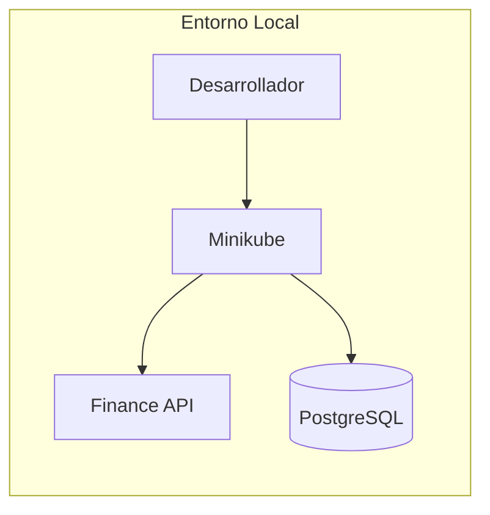

# Despliegue en Minikube

Guía paso a paso para desplegar la aplicación Finance en un clúster de Kubernetes local usando Minikube.

## Descripción General

Este documento describe el proceso completo para configurar un entorno de desarrollo local que replica la arquitectura de producción, permitiendo validar la aplicación antes de desplegarla en Azure AKS.



## Requisitos Previos

### Software Necesario

| Herramienta | Versión Mínima | Comando de Verificación |
|-------------|----------------|-------------------------|
| Docker | 24.0.0+ | `docker --version` |
| Minikube | 1.32.0+ | `minikube version` |
| kubectl | 1.29.0+ | `kubectl version --client` |

```bash
# Verificar todas las herramientas
docker --version && minikube version && kubectl version --client
```

### Recursos del Sistema

| Recurso | Mínimo | Recomendado |
|---------|--------|-------------|
| RAM | 4 GB | 8 GB |
| CPU | 2 núcleos | 4 núcleos |
| Disco | 20 GB | 40 GB |

:::tip Rendimiento
Para un mejor rendimiento en el desarrollo, se recomienda asignar al menos 8 GB de RAM a Minikube, especialmente si planea ejecutar múltiples pods o servicios adicionales como ArgoCD.
:::

## Guía de Despliegue

### Paso 1: Iniciar Minikube

```bash
# Iniciar clúster con recursos adecuados
minikube start \
  --memory=4096 \
  --cpus=2 \
  --driver=docker \
  --kubernetes-version=v1.29.0

# Verificar estado
minikube status
```

**Salida esperada:**

```
minikube
type: Control Plane
host: Running
kubelet: Running
apiserver: Running
kubeconfig: Configured
```

:::note Drivers Alternativos
En sistemas con Hyper-V o VirtualBox disponibles, puede usar `--driver=hyperv` o `--driver=virtualbox` respectivamente. Docker es el driver recomendado por su simplicidad y rendimiento.
:::

### Paso 2: Habilitar Addons

```bash
# Controlador de Ingress (NGINX)
minikube addons enable ingress

# Aprovisionador de Almacenamiento (para PVCs)
minikube addons enable storage-provisioner

# Servidor de Métricas (para HPA y monitoreo)
minikube addons enable metrics-server

# Dashboard de Kubernetes (opcional)
minikube addons enable dashboard

# Verificar addons habilitados
minikube addons list | grep enabled
```

**Salida esperada:**

```
| ingress                     | minikube | enabled ✅   |
| metrics-server              | minikube | enabled ✅   |
| storage-provisioner         | minikube | enabled ✅   |
```

### Paso 3: Configurar Docker

Para construir imágenes directamente en el registro de Minikube:

```bash
# Usar el daemon de Docker de Minikube
eval $(minikube docker-env)

# Verificar que apunta a Minikube
docker info | grep "Name:"
# Debería mostrar "minikube"
```

:::warning Sesión del Terminal
El comando `eval $(minikube docker-env)` solo afecta la sesión actual del terminal. Debe ejecutarlo nuevamente en cada nueva terminal donde necesite construir imágenes.
:::

### Paso 4: Construir la Imagen Docker

```bash
# Navegar al directorio del backend
cd src/backend

# Construir la imagen con tag de desarrollo
docker build -t finance-api:latest -t finance-api:dev .

# Verificar la imagen
docker images | grep finance-api
```

**Salida esperada:**

```
REPOSITORY    TAG       IMAGE ID       CREATED          SIZE
finance-api   latest    abc123def456   10 seconds ago   52MB
finance-api   dev       abc123def456   10 seconds ago   52MB
```

:::tip Optimización de Imagen
La imagen utiliza una construcción multi-stage con Alpine Linux, resultando en un tamaño aproximado de 52MB. Esto mejora significativamente los tiempos de descarga y despliegue.
:::

### Paso 5: Desplegar con Kustomize

```bash
# Navegar al directorio de kubernetes
cd ../../infrastructure/kubernetes

# Aplicar el overlay de desarrollo
kubectl apply -k overlays/dev

# Verificar recursos creados
kubectl get all -n finance-app
```

**Salida esperada:**

```
NAME                               READY   STATUS    RESTARTS   AGE
pod/finance-api-xxx-yyy            1/1     Running   0          30s
pod/postgres-xxx-yyy               1/1     Running   0          30s

NAME                  TYPE        CLUSTER-IP       PORT(S)
service/finance-api   ClusterIP   10.96.xxx.xxx    80/TCP
service/postgres      ClusterIP   10.96.xxx.xxx    5432/TCP

NAME                          READY   UP-TO-DATE   AVAILABLE
deployment.apps/finance-api   1/1     1            1
deployment.apps/postgres      1/1     1            1
```

### Paso 6: Esperar que los Pods estén Listos

```bash
# Esperar por PostgreSQL
kubectl wait --for=condition=ready pod \
  -l app=postgres \
  -n finance-app \
  --timeout=120s

# Esperar por Finance API
kubectl wait --for=condition=ready pod \
  -l app=finance-api \
  -n finance-app \
  --timeout=120s

# Verificar estado final
kubectl get pods -n finance-app -w
```

### Paso 7: Configurar DNS Local

```bash
# Obtener IP de Minikube
MINIKUBE_IP=$(minikube ip)
echo "IP de Minikube: $MINIKUBE_IP"

# Agregar entrada a /etc/hosts (requiere sudo)
echo "$MINIKUBE_IP  app.local api.local" | sudo tee -a /etc/hosts

# Verificar la entrada
grep "app.local" /etc/hosts
```

:::note Windows
En Windows, el archivo hosts se encuentra en `C:\Windows\System32\drivers\etc\hosts`. Debe editarlo como administrador.
:::

### Paso 8: Iniciar Túnel de Minikube

En una **terminal separada** (debe mantenerse ejecutando):

```bash
# Este comando requiere privilegios elevados
minikube tunnel
```

:::info Túnel Persistente
El túnel debe mantenerse ejecutando mientras trabaje con la aplicación. Si lo cierra, perderá la conectividad con los servicios tipo LoadBalancer e Ingress.
:::

### Paso 9: Verificar el Despliegue

#### Verificación de Salud del API

```bash
# Endpoint de salud general
curl -s http://app.local/health | jq

# Respuesta esperada:
{
  "status": "healthy",
  "timestamp": "2024-01-15T10:30:00Z",
  "service": "finance-api",
  "version": "1.0.0"
}
```

#### Verificar Conexión a Base de Datos

```bash
# Endpoint de salud de la base de datos
curl -s http://app.local/health/db | jq

# Respuesta esperada:
{
  "status": "healthy",
  "database": "connected",
  "timestamp": "2024-01-15T10:30:00Z",
  "message": "Database connection successful"
}
```

#### Acceder a Swagger UI

Abrir en el navegador: **http://app.local**

La documentación interactiva de Swagger permite explorar y probar todos los endpoints de la API.

### Paso 10: Probar la API

#### Crear una Transacción

```bash
curl -X POST http://app.local/api/transactions \
  -H "Content-Type: application/json" \
  -d '{
    "description": "Transacción de prueba",
    "amount": 100.50,
    "type": "credit"
  }' | jq
```

#### Listar Transacciones

```bash
curl -s http://app.local/api/transactions | jq
```

## Métodos Alternativos de Acceso

### Port Forward

Si el túnel de Minikube no funciona correctamente:

```bash
# En una terminal separada
kubectl port-forward svc/finance-api -n finance-app 8080:80

# Acceder vía localhost
curl http://localhost:8080/health
```

### NodePort Directo

```bash
# Obtener URL del servicio
minikube service finance-api -n finance-app --url
```

## Verificación y Diagnóstico

### Verificar Logs

```bash
# Logs del API en tiempo real
kubectl logs -f deployment/finance-api -n finance-app

# Logs de PostgreSQL
kubectl logs -f deployment/postgres -n finance-app

# Logs con timestamps
kubectl logs deployment/finance-api -n finance-app --timestamps
```

### Verificar Persistencia de Datos

```bash
# Crear datos de prueba
curl -X POST http://app.local/api/transactions \
  -H "Content-Type: application/json" \
  -d '{"description": "Prueba de persistencia", "amount": 50.00, "type": "debit"}'

# Reiniciar el pod de PostgreSQL
kubectl rollout restart deployment/postgres -n finance-app

# Esperar que esté listo
kubectl wait --for=condition=ready pod \
  -l app=postgres \
  -n finance-app \
  --timeout=120s

# Verificar que los datos persisten
curl -s http://app.local/api/transactions | jq
```

### Verificar Recursos

```bash
# Ver uso de recursos de los pods
kubectl top pods -n finance-app

# Ver eventos recientes
kubectl get events -n finance-app --sort-by='.lastTimestamp'
```

## Script Automatizado

Todo el proceso está automatizado en un script:

```bash
chmod +x scripts/deploy-minikube.sh
./scripts/deploy-minikube.sh
```

El script realiza todas las verificaciones necesarias y proporciona retroalimentación en cada paso.

## Solución de Problemas

### Pod en estado CrashLoopBackOff

```bash
# Ver logs del pod problemático
kubectl logs pod/finance-api-xxx -n finance-app --previous

# Describir el pod para ver eventos
kubectl describe pod/finance-api-xxx -n finance-app

# Verificar variables de entorno
kubectl exec -it deployment/finance-api -n finance-app -- env | grep -E "(DB_|ASPNETCORE)"
```

### Ingress no Responde

```bash
# Verificar controlador de ingress
kubectl get pods -n ingress-nginx

# Verificar configuración del ingress
kubectl describe ingress finance-app-ingress -n finance-app

# Verificar logs del controlador
kubectl logs -n ingress-nginx deployment/ingress-nginx-controller
```

### PVC en estado Pending

```bash
# Verificar storage class
kubectl get storageclass

# Verificar estado del PVC
kubectl describe pvc -n finance-app

# Si no hay storage class disponible
minikube addons enable storage-provisioner
kubectl apply -k overlays/dev
```

### API no Conecta a PostgreSQL

```bash
# Verificar que postgres está corriendo
kubectl get pods -l app=postgres -n finance-app

# Verificar el servicio
kubectl get svc postgres -n finance-app

# Probar conexión desde dentro del clúster
kubectl run -it --rm debug \
  --image=postgres:16-alpine \
  --restart=Never \
  -n finance-app \
  -- psql -h postgres -U postgres -d financedb -c "SELECT 1"
```

### Problemas de Memoria

```bash
# Verificar uso de memoria de Minikube
minikube ssh "free -m"

# Aumentar memoria si es necesario
minikube stop
minikube start --memory=8192
```

## Limpieza

### Eliminar Solo la Aplicación

```bash
# Eliminar recursos de la aplicación
kubectl delete -k infrastructure/kubernetes/overlays/dev

# Verificar limpieza
kubectl get all -n finance-app
```

### Limpieza Completa

```bash
# Detener Minikube (preserva el clúster)
minikube stop

# Eliminar clúster completamente
minikube delete

# Limpiar entradas de /etc/hosts
sudo sed -i '/app.local/d' /etc/hosts
```

## Resumen de Comandos Útiles

| Comando | Descripción |
|---------|-------------|
| `minikube status` | Ver estado del clúster |
| `minikube dashboard` | Abrir dashboard de Kubernetes |
| `minikube ssh` | Acceder a la VM de Minikube |
| `minikube logs` | Ver logs de Minikube |
| `kubectl get all -n finance-app` | Ver todos los recursos |
| `kubectl logs -f deployment/finance-api -n finance-app` | Ver logs en tiempo real |

## Siguiente Paso

Una vez validado el despliegue local, puede proceder a configurar [GitOps con ArgoCD](./argocd) para automatizar despliegues continuos.